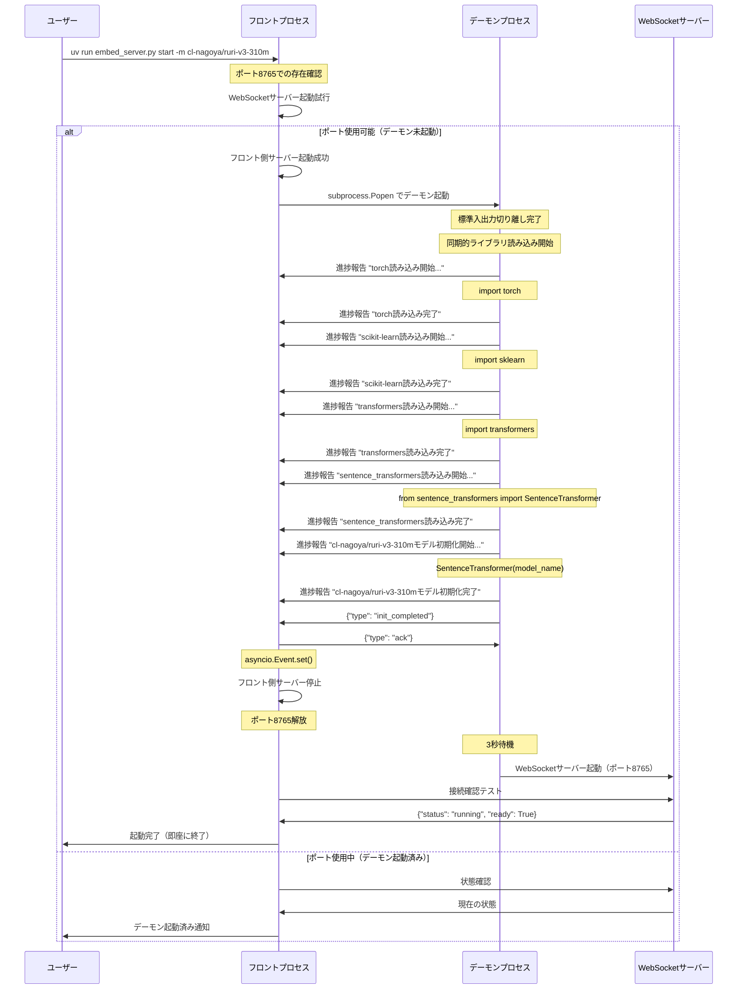

# Twilog検索システム デーモン分離アーキテクチャ実装レポート

## 概要

重いライブラリ（torch、transformers、sentence_transformers）の読み込み処理をWebSocketサーバープロセスに分離し、フロントエンド側の起動時間を劇的に短縮するアーキテクチャを実装しました。

## アーキテクチャ概要

### 基本設計思想

1. **プロセス分離**: 重い処理を独立したデーモンプロセスで実行
2. **Apache風操作**: 直感的なコマンドインターフェース
3. **非同期通信**: WebSocketによるリアルタイム進捗報告
4. **完全分離**: 親子プロセス関係の完全な切り離し

## シーケンス図



## 核心技術ポイント

### 1. 完全なプロセス分離

```python
subprocess.Popen([
    sys.executable, __file__, "_daemon"
], stdin=subprocess.DEVNULL, 
   stdout=subprocess.DEVNULL,  # 重要: 標準出力切り離し
   stderr=subprocess.DEVNULL,  # 重要: 標準エラー切り離し
   start_new_session=True)      # 新しいセッションで起動
```

**重要ポイント**: `stdout/stderr=subprocess.DEVNULL`の設定が親プロセス待機を防ぐ鍵

### 2. 非同期完了通知システム

```python
class FrontendServer:
    def __init__(self):
        self.init_complete_event = asyncio.Event()  # 非同期イベント
    
    async def wait_for_init_complete(self):
        await self.init_complete_event.wait()  # ポーリングなし
```

従来のポーリング方式を排除し、`asyncio.Event`による効率的な非同期待機を実現。

### 3. ポート重複による存在確認とフロント側一時サーバー

```python
try:
    frontend_server = await websockets.serve(handler, HOST, PORT)
    # ポート使用可能 = デーモン未起動
    print("デーモンは起動していません。新規起動します...")
    
    # デーモン起動後、フロント側一時サーバーで初期化通知を受信
    async with frontend_server:
        await frontend.wait_for_init_complete()  # タイムアウトなし
    
except OSError as e:
    if "Address already in use" in str(e):
        # ポート使用中 = デーモン起動済み
        print("デーモンは既に起動しています")
```

**この方式の革新性**:

1. **二重の役割**: ポート確認とタイムアウト回避を同時解決
2. **確実な検出**: PIDファイルより信頼性の高いポートベース検出
3. **自然な切り替え**: 存在確認→一時サーバー→通知受信の流れ
4. **Zero Configuration**: 設定ファイル不要の自動検出

## 解決した技術課題

### 課題1: WebSocket keepaliveタイムアウト

**問題**: 重い処理中にWebSocket接続が`1011 internal error`でタイムアウト

**従来のアプローチの限界**:
```python
# ❌ デーモン側にサーバーを立てる従来方式
daemon_server = await websockets.serve(handler, HOST, PORT)
# 重い処理中にクライアント接続がタイムアウト
await heavy_initialization()  # 85秒の処理でタイムアウト
```

**革新的解決策**: フロント側一時サーバー方式
```python
# ✅ フロント側に一時サーバーを立てる新方式
frontend_server = await websockets.serve(notification_handler, HOST, PORT)
# デーモン側から能動的に進捗報告
# タイムアウトリスクなし
```

**技術的ブレークスルー**:
1. **逆転の発想**: クライアント→サーバーではなく、サーバー→クライアント通信
2. **フロント側制御**: フロント側がサーバーとしてデーモンからの通知を受信
3. **タイムアウト回避**: デーモン側が能動的に接続するため、keepaliveタイムアウトが発生しない
4. **進捗の可視化**: 各段階でリアルタイム進捗表示

### 課題2: 親プロセス待機問題

**問題**: `start_new_session=True`でも親プロセスが子プロセス終了を待機

**解決策**: 標準入出力パイプの完全切り離し
```python
stdout=subprocess.DEVNULL, stderr=subprocess.DEVNULL
```

この設定により、親プロセスが子プロセスのI/Oを待機することを防止。

### 課題3: 同期処理での非同期通信

**問題**: 重いライブラリ読み込み中に`asyncio.run()`を呼び出すとエラー

**解決策**: 初期化処理全体を非同期化
```python
async def init_models_async(self):
    await self.report_progress("torch読み込み開始...")
    import torch  # 重い処理
    await self.report_progress("torch読み込み完了")
```

## パフォーマンス効果

### 起動時間の劇的改善

- **従来**: 数分（全ライブラリの同期読み込み）
- **改善後**: 数秒（デーモン存在確認のみ）

### ライブラリ読み込み時間（実測）

| ライブラリ | 読み込み時間 |
|-----------|-------------|
| torch | 11.26秒 |
| scikit-learn | 5.40秒 |
| transformers | 12.81秒 |
| sentence_transformers | 31.89秒 |
| モデル初期化 | 23.47秒 |
| **合計** | **約85秒** |

デーモン分離により、この重い処理をバックグラウンド化し、フロント側の即座起動を実現。

## 運用上の利点

### 1. Apache風操作性
```bash
uv run embed_server.py start -m cl-nagoya/ruri-v3-310m     # 起動
uv run embed_server.py status                              # 状態確認
uv run embed_server.py stop                                # 停止
```

### 2. 安定性向上
- プロセス独立により、フロント側エラーがデーモンに影響しない
- デーモン側エラーでもフロント側操作は継続可能

### 3. 開発効率向上
- 開発中の頻繁な再起動でも待機時間なし
- リアルタイム進捗表示による状況把握

## 今後の拡張可能性

1. **複数ポート対応**: 異なるモデル用のデーモン並行実行
2. **ヘルスモニタリング**: デーモンの健康状態監視
3. **動的モデル切り替え**: 実行時モデル変更対応
4. **負荷分散**: 複数デーモンへのリクエスト分散

## 核心的技術革新ポイント

### フロント側一時サーバーによるタイムアウト解決

**従来方式の根本的問題**:
- デーモン側サーバー: クライアントが長時間接続を維持→keepaliveタイムアウト必須
- 重い処理: 85秒の初期化中、WebSocket接続がタイムアウト

**革新的解決策**:
```python
# フロント側に一時サーバーを立てる
frontend_server = await websockets.serve(notification_handler, HOST, PORT)

# デーモン側から短時間接続で進捗報告
await websocket.send(json.dumps({"type": "progress", "message": "torch読み込み開始..."}))
await websocket.close()  # すぐに切断
```

**なぜタイムアウトしないのか**:
1. **短時間接続**: デーモン→フロント接続は数秒で完了
2. **能動的通信**: デーモンが必要な時だけ接続
3. **接続分離**: 各進捗報告で独立した接続
4. **フロント制御**: フロント側がサーバーとして安定待機

### ポートエラーによる存在検出の秀逸さ

```python
try:
    # ポート8765でサーバー起動を試行
    frontend_server = await websockets.serve(handler, HOST, PORT)
    # 成功 = デーモン未起動
except OSError as e:
    if "Address already in use" in str(e):
        # 失敗 = デーモン起動済み
```

**この方式の優位性**:
- **原子的操作**: ポート確認と一時サーバー起動が同時
- **競合状態回避**: ポート確認→起動の間に他プロセスが割り込む隙がない
- **確実性**: PIDファイルの読み書きエラーリスクなし
- **シンプル性**: 追加ファイル・設定不要

## まとめ

この実装における最大の技術革新は、**フロント側一時サーバー**によるタイムアウト問題の根本解決です。

従来の「クライアント→サーバー」の固定概念を覆し、初期化フェーズでは「フロント側がサーバー、デーモン側がクライアント」という逆転発想により、85秒の重い処理でもタイムアウトすることなく、リアルタイムな進捗表示を実現しました。

さらに、ポートエラーを積極活用した存在検出機能により、Zero Configurationでの確実なデーモン管理を可能にし、Apache風の直感的なコマンドインターフェースと相まって、開発・運用両面での利便性を革新的に改善することができました。
